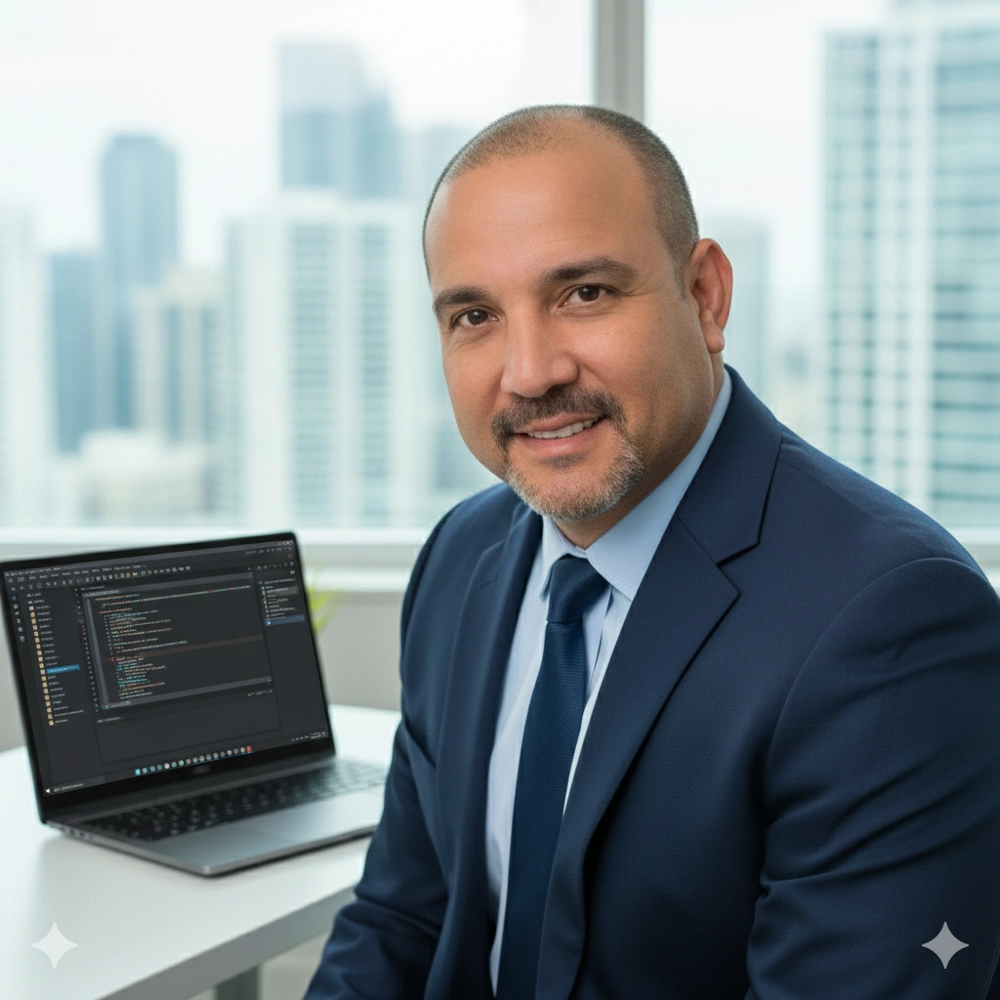

# Portfolio Project

This is a personal portfolio project built with Astro. It showcases my work, skills, and background as a developer, speaker, and writer.



## Features

- **Responsive Design**: Works on all devices, from mobile to desktop.
- **Internationalization**: Supports multiple languages (English and Spanish).
- **Dark/Light Mode**: Toggle between themes for better user experience.
- **Portfolio Showcase**: Displays projects with detailed descriptions and images.
- **Skills Section**: Highlights technical skills and expertise.
- **Contact Form**: Allows visitors to get in touch easily.

## Technologies Used

- **Astro**: A modern static site builder for fast, content-focused websites.
- **TypeScript**: For type-safe JavaScript development.
- **CSS**: For styling and layout.
- **Prettier**: For code formatting.

## Getting Started

To run this project locally, follow these steps:

1. **Clone the repository**:
   ```sh
   git clone https://github.com/yourusername/portfolio.git
   cd portfolio
   ```

2. **Install dependencies**:
   ```sh
   pnpm install
   ```

3. **Start the development server**:
   ```sh
   pnpm dev
   ```

4. **Build for production**:
   ```sh
   pnpm build
   ```

5. **Preview the build**:
   ```sh
   pnpm preview
   ```

## Project Structure

- `src/`: Contains the main source code for the portfolio.
  - `components/`: Reusable components like Hero, Skills, and ContactForm.
  - `content/`: Markdown files for portfolio projects.
  - `i18n/`: Internationalization files for language support.
  - `layouts/`: Layout components for the site.
  - `pages/`: Astro pages for the site.
  - `styles/`: Global CSS styles.
- `public/`: Static assets like images and fonts.
- `astro.config.mjs`: Astro configuration file.
- `package.json`: Project dependencies and scripts.

## License

This project is licensed under the MIT License. See the [LICENSE](LICENSE) file for details.

## Contact

For any questions or feedback, feel free to reach out via the contact form on the portfolio or through my social media channels.

---
